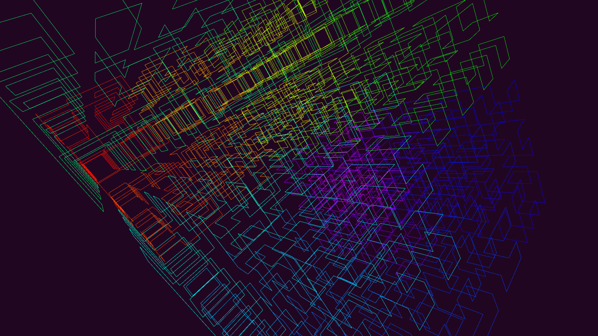

# HilbertCurve3D

This is my Hilbert curve implementation in Unity. It produces a Hilbert curve in 3D, and renders a small demo out of it.
Rendering is done using GL draw lines.

Hilbert curve is a continuous, fractal space-filling curve, which visits each position of the space exactly once. Named after the German mathematician David Hilbert who first described it.

[Wikipedia, Hilbert curve](https://en.wikipedia.org/wiki/Hilbert_curve "Wikipedia, Hilbert curve")

© 2020 Olli Sorjonen All Rights Reserved
